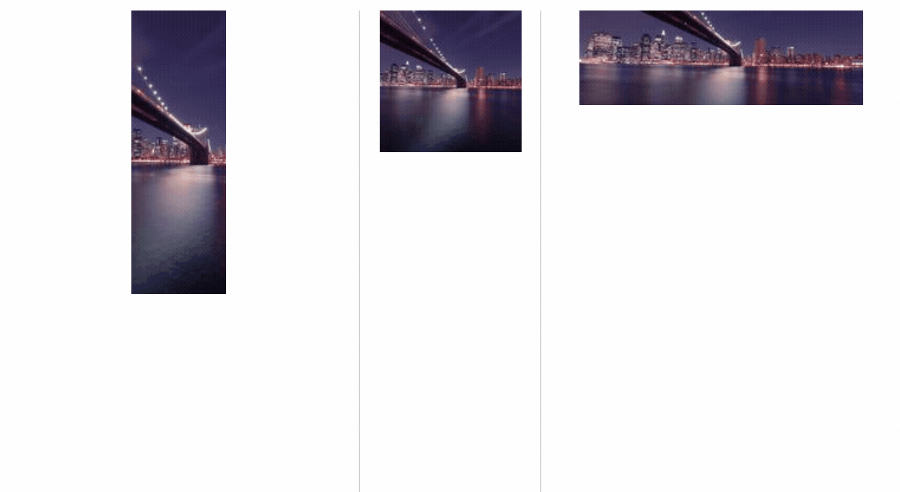
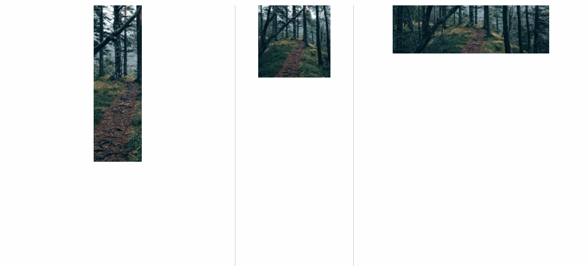

# Image Labeler

`image-labeler` provides autosuggested labels for images or video. It relies on a Neural Network performing inference in the browser to calculate suggestions.

It was originally developed for the book [Deep Learning With Javascript](https://dljsbook.com).

[](https://opensource.org/licenses/MIT)
[](https://circleci.com/gh/thekevinscott/image-labeler)


[View a live demo](https://thekevinscott.github.io/image-labeler/).

## Table of Contents

* [Getting Started](#getting-started)
* [Usage](#usage)
* [API](#api)
* [Tests](#test)
* [Versioning](#versioning)
* [Contributing](#contributing)
* [Author](#author)
* [License](#license)
* [Acknowledgments](#acknowledgments)

## Getting Started

<a href="#table-of-contents">Back to Top</a>

### Via script tag

You can use `image-labeler` via a `<script />` tag:

```
<html>
  <head>
    <script src="https://cdn.jsdelivr.net/npm/@tensorflow/tfjs@0.15.1/dist/tf.min.js"></script>
    <script src="https://cdn.jsdelivr.net/npm/image-labeler/dist/index.umd.min.js"></script>
    <script>
      const imageLabeler = new ImageLabeler();
      imageLabeler.label('https://imgur.com/some-image').then(suggestions => {
        console.log(suggestions);
        // ['one', 'two', 'three'];
      });
    </script>
  </head>
</html>
```

### Via ES6

Install with:

```
// npm
npm install image-labeler

// yarn
yarn add image-labeler
```

```
import ImageLabeler from 'image-labeler';
const imageLabeler = new ImageLabeler();
imageLabeler.label('https://imgur.com/some-image').then(suggestions => {
  console.log(suggestions);
  // ['one', 'two', 'three'];
});
```

## Usage

<a href="#table-of-contents">Back to Top</a>

`image-labeler` relies on Tensorflow.js, a Deep Learning framework released by Google. Currently only browser-based use cases are supported.

### Labels

By default, `image-labeler` uses [MobileNet](https://arxiv.org/abs/1704.04861), a pretrained model developed and released by Google. It's fast and runs well in the browser, and is trained on [ImageNet](http://www.image-net.org), a large corpus of images with 1000 labels. The original labels are stored as a [JSON file](https://github.com/thekevinscott/image-labeler/blob/master/src/labels/original.json), but `image-labeler` uses a set of [simplied labels](https://github.com/thekevinscott/image-labeler/blob/master/src/labels/simple.ts) put together by [@anishathalye](https://github.com/anishathalye).

The ImageNet labels are fairly literal:

```
...
"candle",
"cannon",
"canoe",
"can opener",
"cardigan",
"car mirror",
"carousel",
...
```

If literal labels fit your use case, then the defaults will work fine. If you wish to provide more descriptive labels, you can provide your [own model and labels trained on your own dataset](#constructor).

For assistance training a pretrained model, see [`ml-classifier`](http://github.com/thekevinscott/ml-classifier), a tool for tuning MobileNet with custom categories and labels in your browser.

### CORS

You may see security errors when loading image `src`s from the Internet. This often is due to CORS.

Browsers apply [strict rules](https://developer.mozilla.org/en-US/docs/Web/HTML/CORS_enabled_image) regarding cross-origin data accessible via `<canvas />`. `image-labeler` relies on the [`getPixels` method](https://js.tensorflow.org/api/0.15.1/#browser.fromPixels) of Tensorflow.js, which in turn relies on the `<canvas />` element.

The easiest way around CORS issues is to host the images yourself, and access them via your own domain with your own CORS policy.

A second option is to rely on a CORS-friendly image hosting service. At the time of this writing, Imgur has a fairly liberal CORS policy for accessing their images.

A third option is to use a proxy server for routing, such as [CORS Anywhere](https://cors-anywhere.herokuapp.com). I don't recommend this method for production services, as it relies on a third party not shutting off access, but for quick prototyping it's an option.

### Filters

`image-labeler` uses an innovation borrowed from [YOLO](https://pjreddie.com/darknet/yolo/) to increase the amount of image data and increase the granularity with which predictions are made.

Incoming images are divided into pieces, based on the size of the Neural Network's input layer. Let's say you're leveraging the default MobileNet Neural Network. The pieces will be:



`image-labeler` will calculate the minimum size and slide a filter over the entirety of a non-square image until all of the image is processed. Any remainder of an image is merged with what comes before to construct a full image:



You can change the filter size. Here we specify a 50% filter size:


Using filters increases the amount of granularity we can apply to an image, and avoids the loss of any information due to cropping. Labels are returned by confidence in prediction.

You specify filters by passing an array of floats in the form of `[1, 0.5, 0.25]`.

Filters that don't cleanly add up to 100% are treated like remainders, above. Here is an example of a filter of `[0.4]`:


## API

<a href="#table-of-contents">Back to Top</a>

### `constructor`

Initializes the component. Accepts a single argument, `options`, an object with the following properties:

* `modelSettings` _(optional)_ - A pretrained model URL and labels JSON file, in the form of `{ url: 'https://...', labels: { 0: 'melancholy', 1: 'uplifting' ...} }`.
* `numberOfLabels` _(optional)_ - The number of labels to return. Defaults to 5.
* `filters` _(optional)_ - The number of filters to use. Defaults to 2 for images greater than 100 pixels.
* `includeConfidence` _(optional)_ - Whether to include confidence scores for each label or not. Defaults to false.

#### Example

```
new ImageLabeler({
  numberOfLabels: 5,
  filters: 2,
  includeConfidence: true,
});
```

### `configure`

Same function as initialize above, but can be called to update options are instantiation.

#### Example

```
const imageLabeler = new ImageLabeler();
imageLabeler.configure({
  numberOfLabels: 5,
  filters: 2,
  includeConfidence: true,
});
```

### `label`

Returns a list of labels for an image or a list of images.

* `images` - Accepts a single image or a list of images. Can be a string (the URL to an image), a Blob, an HTMLImageElement, an HTMLVideoElement, a Tensor of pixels, or an array of any of the above.
* `callback` - A callback called with the result of `labels. First argument to the callback is error (which is null if no error), and the second argument is the `labels`.
* `options` - Options, as defined on the constructor.

#### Returns

If no callback is specified, returns a Promise that resolves to `labels`.

```
['one', 'two', 'three']
```

If `includeConfidence` is true, `labels` is made up of objects including the label and its confidence:

```
[{ label: 'one', confidence: 0.9 }, { label: 'two', confidence: 0.8 }]
```

#### Example

```
// pass an image
imageClassifier.label('foo').then(labels => {
  console.log(labels);
});

// pass an image and a callback as the second argument.
// in this case, no promise is returned.
imageClassifier.label('foo', (err, labels) => {
  if (err) {
    throw new Error(err);
  }

  console.log(labels);
});

// pass an image and an options object as the second argument
imageClassifier.label('foo', {
  labels: 10,
}).then(labels => {
  console.log(labels);
});

// pass an image, a callback, and an options object as the second argument
imageClassifier.label('foo', (err, labels) => {
  if (err) {
    throw new Error(err);
  }

  console.log(labels);
}, {
  labels: 10,
});
```


`label` label the image .accepts string html image or video and either a callback or options or both .

options can include the number of labels to return (0 is all), and how many filters to utilize. also includeConfidence

### Filters

a gif about how filters work

## Tests

<a href="#table-of-contents">Back to Top</a>

## Versioning

<a href="#table-of-contents">Back to Top</a>

We use [SemVer](http://semver.org/) for versioning. For the versions available, see the [tags on this repository](https://github.com/thekevinscott/image-labeler/tags). 

## Contributing

Please read [CONTRIBUTING.md](CONTRIBUTING.md) for details on our code of conduct, and the process for submitting pull requests to us.

## Author

<a href="#table-of-contents">Back to Top</a>

[Kevin Scott](https://thekevinscott.com)

See also the list of [contributors](https://github.com/thekevinscott/image-labeler/contributors) who participated in this project.

## License

<a href="#table-of-contents">Back to Top</a>

This project is licensed under the MIT License - see the [LICENSE](LICENSE) file for details

## Acknowledgments

<a href="#table-of-contents">Back to Top</a>

This package leverages [`tensorflow.js`](https://js.tensorflow.org) and [MobileNet](https://arxiv.org/abs/1704.04861), both released by Google.

This uses labels from [`imagenet-simple-labels`](https://github.com/anishathalye/imagenet-simple-labels) for cleaner labels from ImageNet.
